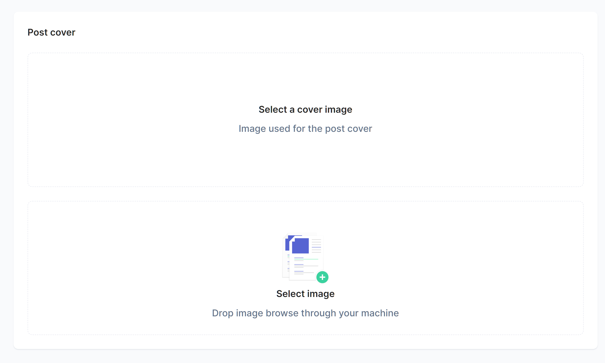

# [react-image-cropper-dropzone](https://www.npmjs.com/package/react-image-cropper-dropzone)


Simple react dropzone for image cropper.

<p align="center"></p>

## Install

```shell
$ npm install react-image-cropper-dropzone
```
or
```shell
$ yarn add react-image-cropper-dropzone
```

## Example ([Online Preview](https://qiming-liu.github.io/react-image-cropper-dropzone/))
```jsx
import React, {useState} from 'react'

// import react-image-cropper-dropzone
import ReactImageCropperDropzone from 'react-image-cropper-dropzone'

// import styles
import UploadSvg from './UploadSvg'
import 'react-image-cropper-dropzone/index.css'

const Demo: React.FC = () => {
  // variable to store image base64
  const [base64, setBase64] = useState<string>('')

  // callback function after image crop
  const afterCrop = (base64: string) => {
    setBase64(base64)
    
    // do something here with base64
    console.log(base64)

    // download image
    const link = document.createElement('a')
    link.href = base64
    link.download = 'image.png'
    link.click()
  }

  // style that display cropped image
  const imageStyle = {
    backgroundImage: `url(${base64})`,
    backgroundPosition: 'center',
    backgroundSize: 'cover',
    borderRadius: 1,
    height: 380,
    mt: 3,
  }

  return (
    <div className="Paper">
      <h6 className="h6">Post cover</h6>
      {base64 ? (
        <div className="Box Border" style={imageStyle}></div>
      ) : (
        <div className="Box Border">
          <h6 className="h6">Select a cover image</h6>
          <h6 className="subtitle">Image used for the post cover</h6>
        </div>
      )}
      <ReactImageCropperDropzone
        accept={{
          'image/jpeg': ['.jpeg', '.jpg'],
          'image/png': ['.png'],
        }}
        afterCut={afterCrop}
        aspectRatio={1}
        lockAspectRatio={true}
      >
        <div className="Box Border Button" role="button" tabIndex={0}>
          <div className="Box">
            <UploadSvg />
            <h6 className="h6">Select image</h6>
            <h6 className="subtitle">Drop image browse through your machine</h6>
          </div>
        </div>
      </ReactImageCropperDropzone>
    </div>
  )
}

export default Demo
```
